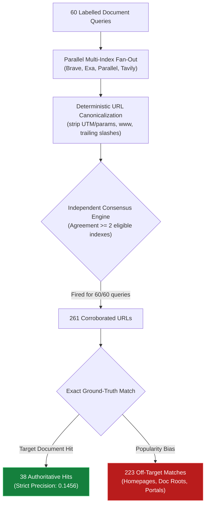

<h1 align="center">dSearch</h1>

<p align="center">
  <b>261 URLs were corroborated across eligible search indexes. 38 matched the labelled page.</b><br>
  Completed falsification study · 60 labelled queries · no product release
</p>

<p align="center">
  <a href="#result">Result</a> ·
  <a href="#reproduce">Reproduce</a> ·
  <a href="#experiment">Experiment</a> ·
  <a href="#retained-implementation">Implementation</a> ·
  <a href="#audit-notes">Audit notes</a> ·
  <a href="#evidence">Evidence</a>
</p>

<p align="center">
  
  <a href="https://github.com/TomaszGonczar/dsearch/actions/workflows/ci.yml"></a>
  <a href="https://www.python.org/downloads/"></a>
  
  <a href="LICENSE"></a>
</p>

---

> [!IMPORTANT]
> dSearch is an archived research repository. It contains a deterministic core and recorded
> evaluation evidence, not an installable search router, CLI, MCP server, or supported package.

## Result

The hypothesis was that a canonical URL returned by two independent search indexes carried
useful evidence of correctness. The providers agreed often. Their agreement did not identify the
labelled document reliably.

| Measurement | Observed |
|---|---:|
| Labelled document queries | 60 |
| Queries where consensus fired | 60 / 60 |
| URLs returned by at least two eligible indexes | 261 |
| Exact matches to a labelled URL | 38 |
| Strict precision | **0.1456** |
| Wilson 95% confidence interval | **[0.108, 0.194]** |

Consensus fired across all 60 queries and produced 261 corroborated URLs, but only 38 were exact matches to the labelled page (strict precision 0.1456).

An exploratory inclusive analysis also found a negative association between agreement rate and
precision (`r = -0.287`, two-sided `p = 0.026`). That secondary result has classification and
provenance limitations, so the engineering decision rests on strict precision.

> **Decision:** consensus remains descriptive metadata. Product development stopped before the
> provider runtime and agent integrations were built.

## Reproduce

The core tests and stored classification run without network access or provider credentials.

```bash
git clone https://github.com/TomaszGonczar/dsearch.git
cd dsearch
python3 -m pip install -e '.[dev]'
python3 -m pytest -q
python3 -m ruff check .
python3 experiments/ds3/classify.py
```

Expected headline output:

```text
78 passed
All checks passed!

exact                    38
alternate                 9
wrong                   214
all_corroborations      261
precision, STRICT         0.1456
```

`classify.py` reproduces the committed classification, including the alternate-label issue
described in [Audit notes](#audit-notes). It does not recreate the live provider calls.

## Experiment

dSearch began with a failure observed in an AI coding session: three web searches returned zero
results without surfacing a useful failure to the model. One call took 264 seconds. The proposed
router had two separate claims:

1. Search should return a bounded, attributed outcome, including when no results are found.
2. Agreement across independent indexes might indicate that a result deserves more trust.

The first claim produced deterministic engineering components. The second was the proposed trust
signal and was tested before building the runtime around it.



The evaluation used 60 document-finding queries with one or more labelled authoritative URLs.
Scheme, `www`, trailing slash, tracking parameters, and query ordering were normalized before URL
comparison. A URL counted as corroborated when at least two eligible providers returned it.

This benchmark evaluates document retrieval only; no model-generated answers were scored.

The first 22-query run produced `12 / 108 = 0.1111` strict precision. Extending the same method to
60 queries produced `38 / 261 = 0.1456`.

## Retained implementation

| Implemented and tested | Not built |
|---|---|
| Attributed envelopes, including explicit zero-result outcomes | Live provider orchestration |
| URL canonicalization | Search CLI |
| Pairwise agreement rates | MCP server and agent adapters |
| Context-aware output budgets | Local search ledger |
| Provider declarations and recorded contract fixtures | Release package |
| Malformed provider URL handling | Supported end-to-end product |

The retained core is deterministic: no clock, locale dependence, network access, or model
judgement appears in its result path. The test suite contains 78 offline tests.

### Using the pure core library

The core components run on pure Python 3.11+ standard library with zero runtime dependencies:

```python
from core.canonical import canonicalize_url
from core.envelope import SearchEnvelope, SearchResult
from core.budget import ContextBudget

# 1. Deterministic URL normalization
url = canonicalize_url("https://docs.python.org/3/library/sys.html?utm_source=dev#mod")
# -> "docs.python.org/3/library/sys.html"

# 2. Immutable attributed search envelope
envelope = SearchEnvelope(
    query="python sys module",
    results=[SearchResult(url=url, title="sys — System-specific parameters", snippet="...")]
)

# 3. Tighten output into strict LLM context budget (e.g. 2KB)
compact = ContextBudget(max_bytes=2048).tighten(envelope)
```

## Audit notes

A separate verification pass reproduced strict precision and found four limits on the wider
analysis:

- **Alternate labels:** `classify.py` reports nine alternates, but the annotations for two of them
  say they should remain wrong. The committed inclusive value is `0.1801`; applying the stated
  conservative rule gives `45 / 261 = 0.1724`. Strict precision is unchanged.
- **Label chronology:** result timestamps precede the commits that first contain the labels, while
  label metadata timestamps are later. Repository history does not establish that labels predated
  provider calls.
- **Overlap evidence:** the preliminary overlap artifact omits the raw URLs and repeated calls
  needed to recompute every Jaccard and stability claim. It records Parallel repeat stability at
  `J = 0.82`, not `1.00`.
- **Secondary statistics:** code for the permutation, median-split, domain-precision, and
  correlation calculations was not committed. The negative correlation is therefore exploratory.

These limitations do not change the strict numerator or denominator: 38 exact matches among 261
corroborated URLs.

## Evidence

| Path | Contents |
|---|---|
| [`experiments/ds3/data/`](experiments/ds3/data/) | Raw provider output, per-query scores, and classifications for the 22- and 60-query runs |
| [`experiments/ds3/eval-set.json`](experiments/ds3/eval-set.json) | The 60 labelled document queries |
| [`experiments/ds3/classify.py`](experiments/ds3/classify.py) | Reproducible strict-precision classification |
| [`docs/DS3-DECISION.md`](docs/DS3-DECISION.md) | Contemporaneous decision record with an archival audit warning |
| [`docs/EXPERIMENT-OVERLAP.md`](docs/EXPERIMENT-OVERLAP.md) | Preliminary provider-overlap experiment and its limitations |
| [`core/`](core/) | Deterministic envelope, canonicalization, consensus, and budget code |
| [`tests/`](tests/) | Offline unit, property, weak-spot, and provider-contract tests |

Raw responses and both evaluation runs remain committed so the result can be inspected without
repeating the live provider calls.

## License

This project is licensed under the [MIT License](LICENSE).
