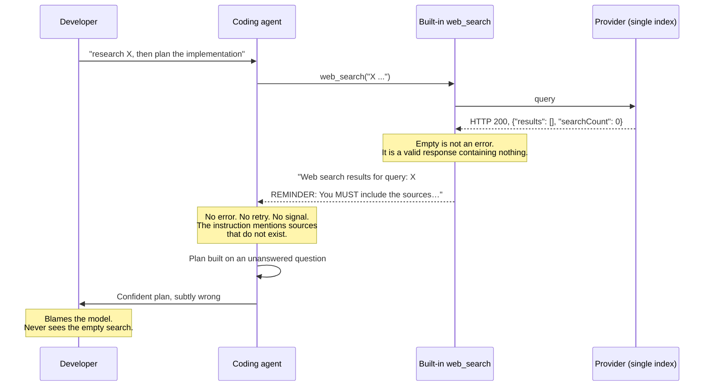
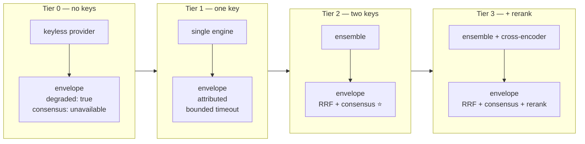

# Diagrams

> [!WARNING]
> Historical design diagrams. They show the proposed end-to-end router, most of which was never
> implemented. The retained code covers provider contracts and the deterministic pure core; see
> the [README](../README.md) for the final scope.

Visual companion to [`CONCEPT.md`](CONCEPT.md). GitHub renders these as diagrams; a terminal
shows them as ASCII.

---

## 1. The corruption path — what actually happens today

The failure is not the search. It is what the agent does next.

**The three things that did not happen:** the search did not error, the agent did not notice,
and nothing was recorded. The corruption is complete before anyone can intervene.

---

## 2. search-router — parallel fan-out, fusion, consensus

```mermaid
flowchart TD
    Q["query"] --> SPLIT{"fan-out<br/>(parallel,<br/>8s timeout each)"}

    SPLIT --> P1["Parallel<br/>(agent-optimized)"]
    SPLIT --> B1["Brave<br/>(independent index)"]
    SPLIT -.->|"if &lt;2 succeed"| E1["Exa<br/>(semantic failover)"]

    P1 --> CAN["canonicalize URLs<br/>strip utm_*, www., trailing /"]
    B1 --> CAN
    E1 --> CAN

    CAN --> FUSE["Reciprocal Rank Fusion<br/>score = Σ 1/(60 + rank)"]

    FUSE --> CONS{"2+ independent<br/>indexes agree?"}
    CONS -->|yes| MARK["consensus: true ⭐"]
    CONS -->|no| SOLO["single-source<br/>(explicitly marked)"]

    MARK --> RR{"rerank"}
    SOLO --> RR
    RR -->|key present| CO["Cohere cross-encoder"]
    RR -->|no key| LOCAL["local TF cosine<br/>(deterministic, stdlib)"]

    CO --> ENV["attributed envelope"]
    LOCAL --> ENV

    ENV --> OUT["providers_attempted<br/>providers_succeeded<br/>errors{}<br/>consensus_count<br/>total_results"]

    style MARK fill:#2d4a2d
    style SOLO fill:#4a3d2d
    style ENV fill:#2d3a4a
```

Two design choices carry the product:

- **Canonicalize before fusing.** Without stripping `utm_*` and normalizing `www.`, three
  engines returning the same page look like three different results — and consensus never
  fires. This step is what makes agreement detectable.
- **Consensus is computed, never opined.** RRF over independent rankings is arithmetic. No
  model grades the results, so the trust signal cannot hallucinate.

---

## 3. Degradation — always a working tool, never a broken one

The tier changes. The contract does not.

Every tier returns the **same envelope shape**. A caller never rewrites code because the
provider set changed — which is also what makes one engine portable across nine agents.

---

## 4. The trust question, and why it needs two indexes

```mermaid
flowchart TD
    subgraph One["One index"]
        Q1["query"] --> R1["one ranking"]
        R1 --> V1{"is this the answer?"}
        V1 --> UNK["unknowable<br/>the index either has it or does not,<br/>and it will not tell you which"]
    end

    subgraph Two["Two independent indexes"]
        Q2["query"] --> A["ranking A"]
        Q2 --> B["ranking B"]
        A --> OV{"overlap on<br/>canonical URL?"}
        B --> OV
        OV -->|"both surface it"| YES["agreement<br/>independent confirmation"]
        OV -->|"only one surfaces it"| NO["single-source<br/>use with caution"]
    end

    style UNK fill:#4a2d2d
    style YES fill:#2d4a2d
    style NO fill:#4a3d2d
```

This is the whole argument for the product in one picture. A single index cannot report its
own gaps — it has no vantage point from which to notice what it is missing. Two independent
indexes can, cheaply and deterministically, by **agreeing**.

---

## 5. Installation surfaces

Same shape as Portfolio #1, because the user is inside their agent.

```mermaid
flowchart TD
    subgraph InAgent["User stays inside the agent"]
        T["search_router tool<br/>(additive)"]
        W["wrapped web_search<br/>(corrective)"]
    end
    subgraph Hosts["Coding agents"]
        CC["Claude Code"]
        CX["Codex"]
        OMP["OMP / pi"]
        AGY["agy"]
        OTH["Cursor · Windsurf · VS Code<br/>Gemini CLI · OpenCode"]
    end
    CORE["one engine"]
    CLI["terminal binary<br/>CI + scripting"]

    T --> CC
    T --> CX
    T --> OTH
    W -.->|"tool_call / PreToolUse<br/>interception"| OMP
    W -.-> CC
    AGY --> T
    CC --> CORE
    CX --> CORE
    OMP --> CORE
    AGY --> CORE
    OTH --> CORE
    CLI --> CORE

    style W fill:#2d3a4a
    style CORE fill:#2d4a2d
```

**Corrective integration is the differentiator.** Additive asks the model to choose
correctly — and the model does not know its default search just returned nothing. Corrective
removes the wrong path rather than competing with it. The dotted edges are the work still to
be verified per agent.

---

## 6. The audit trail — the feature the hook promises

The headline question is *"can you count them?"* Counting requires a record.

```mermaid
flowchart LR
    Q["search"] --> ENV["envelope"]
    ENV --> LOG[("local log<br/>one line per search")]
    LOG --> STATS["search_stats"]
    STATS --> S1["14 searches"]
    STATS --> S2["3 empty"]
    STATS --> S3["2 single-source"]
    STATS --> S4["1 stalled &gt; timeout"]

    style LOG fill:#2d3a4a
    style STATS fill:#2d4a2d
```

Today no agent prints a line like that. The corruption is unmeasurable, so it is
unmanaged. A one-line-per-search local record — no network, no telemetry, the same privacy
posture as Portfolio #1 — converts an invisible failure class into a number a developer can
watch. See open question 4 in `CONCEPT.md`: this may be the headline feature rather than the
search quality itself.
